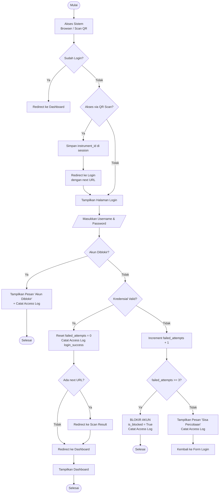
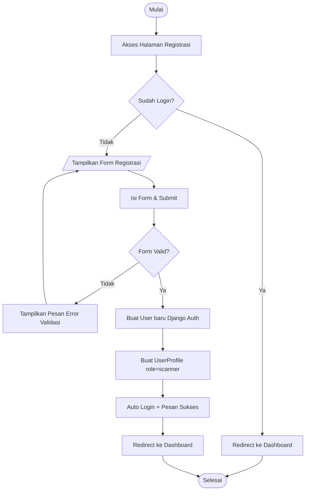
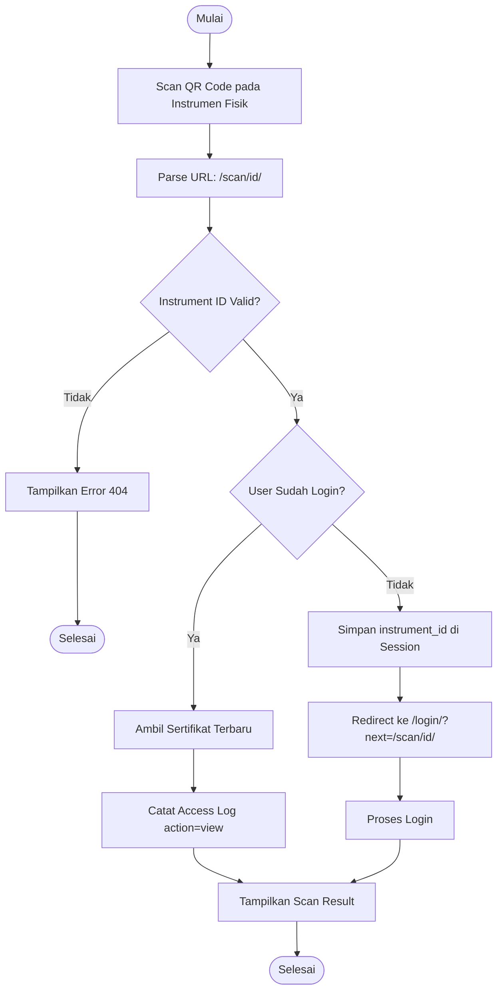
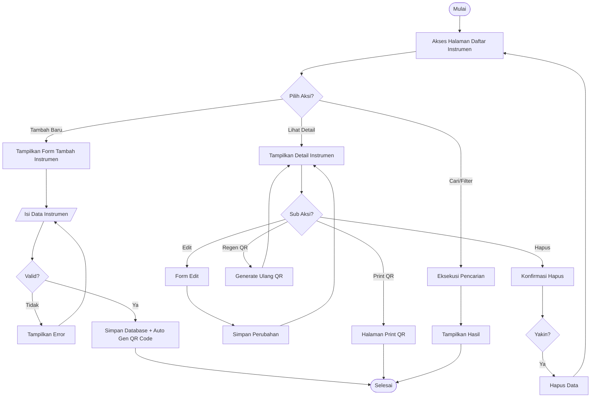
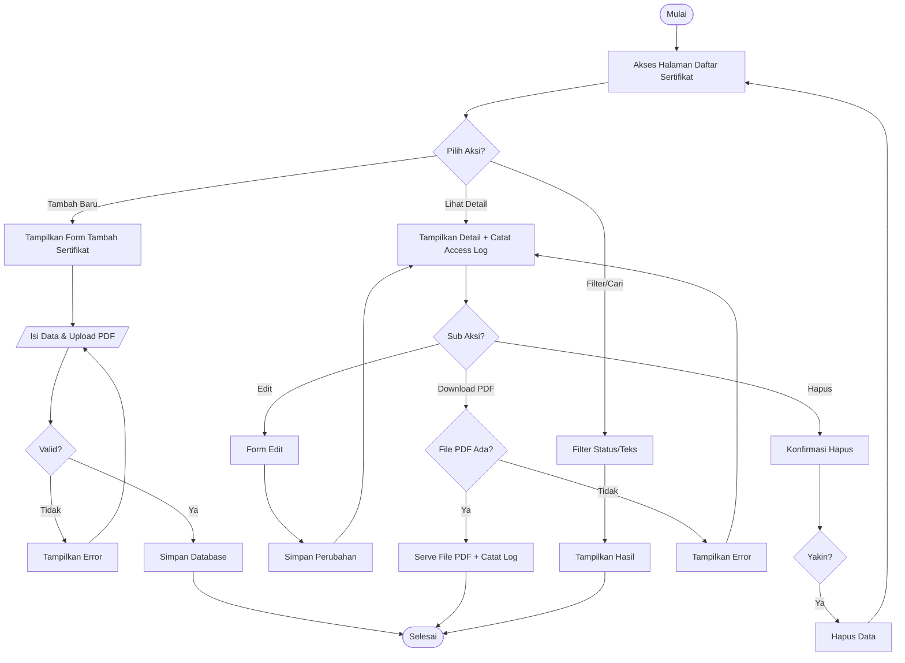
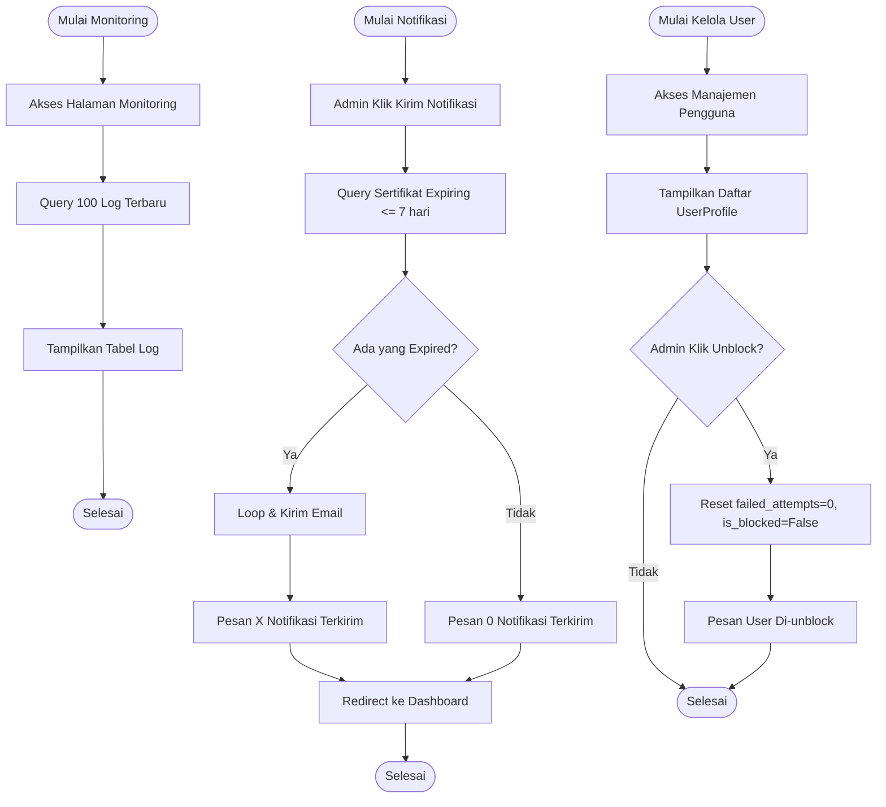

# Flowchart Sistem Manajemen Sertifikat Kalibrasi (Mermaid)

Berikut adalah kode Mermaid untuk seluruh modul flowchart sistem. Anda dapat menyalin kode di bawah ini dan menempelkannya ke [Mermaid Live Editor](https://mermaid.live/), file Markdown (seperti GitHub/GitLab README), atau aplikasi yang mendukung Mermaid (seperti Notion, Obsidian).

---

## 1. Flowchart Utama (Login & Dashboard)



---

## 2. Flowchart Registrasi



---

## 3. Flowchart Scan QR Code



---

## 4. Flowchart Manajemen Instrumen



---

## 5. Flowchart Manajemen Sertifikat



---

## 6. Flowchart Monitoring & Notifikasi Email



---

## 7. Entity Relationship Diagram (ERD)

```mermaid
erDiagram
    User ||--|| UserProfile : "has"
    User ||--o{ AccessLog : "generates"
    Instrument ||--o{ Certificate : "has"
    Instrument ||--o{ AccessLog : "referenced in"
    Certificate ||--o{ AccessLog : "referenced in"

    User {
        int id PK
        string username
        string email
        string password
    }

    UserProfile {
        int id PK
        int user_id FK
        string nama_lengkap
        string instansi
        string role
        boolean is_blocked
        int failed_attempts
        datetime blocked_at
    }

    Instrument {
        uuid id PK
        string nama_alat
        string merk
        string nomor_seri UNIQUE
        string lokasi
        string qr_code
        datetime created_at
    }

    Certificate {
        uuid id PK
        uuid instrument_id FK
        string nomor_sertifikat UNIQUE
        date tanggal_kalibrasi
        date tanggal_berlaku
        string file_sertifikat
        boolean is_active
    }

    AccessLog {
        int id PK
        int user_id FK
        uuid instrument_id FK
        uuid certificate_id FK
        string action
        string ip_address
        datetime accessed_at
    }
```
